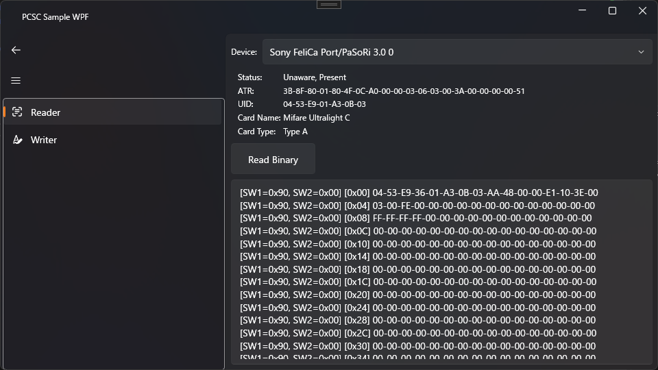

# PCSC Sample WPF



## Description

Sample WPF application for trying PCSC with MVVM.

## Requirement

- Windows 11 Pro 24H2+
- .NET 8
- Visual Studio 2022

## Usage

Build this with Visual Studio 2022 and run.

## Install

Fork and clone this repository.

```
$ git clone git@github.com:yourname/PCSCSampleWpf.git
```

## Contribution

1. Fork this repository
2. Create your feature branch
3. Commit your changes
4. Push to the branch
5. Create new Pull Request

## License

MIT License

## Author

[minato](https://blog.minatoproject.com/)
